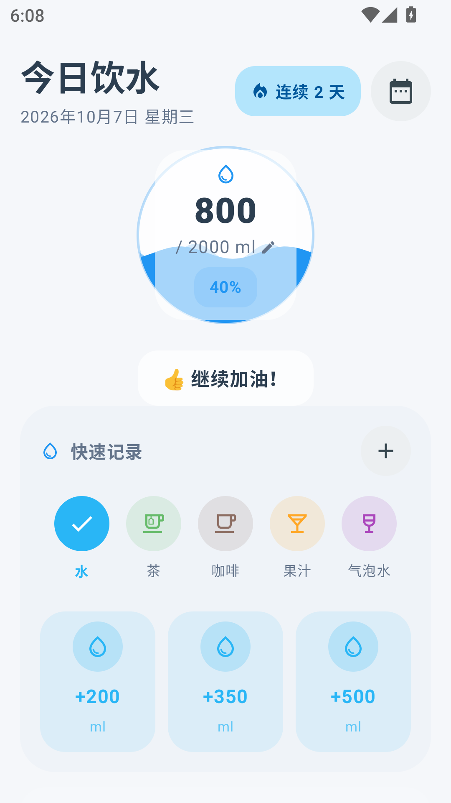
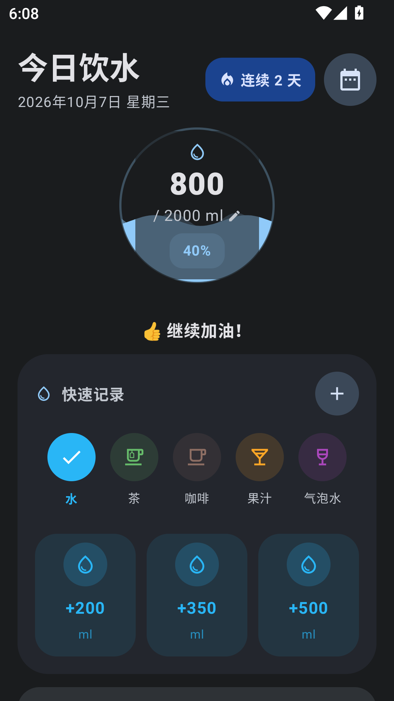
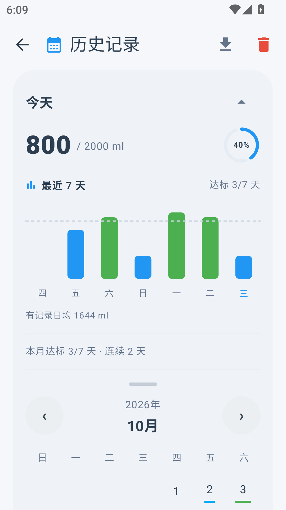

# 喝水提醒 WaterReminder

[](https://github.com/os233/WaterReminder/releases/latest)
[](LICENSE)


一个轻量的 Android 喝水提醒应用。按小时提醒你喝水，记录每一杯，并按饮品类型折算真实补水量。

Kotlin + Jetpack Compose 编写，无广告、无账号、无联网上传 —— 只有检查更新时会向 GitHub Pages
请求一次静态的版本清单。

项目官网（GitHub Pages）：<https://os233.github.io/WaterReminder/>

## 界面预览

| 首页 · 浅色 | 首页 · 深色 | 历史与统计 |
| --- | --- | --- |
|  |  |  |

## 功能亮点

- 💧 **一键记录**：首页大卡片、提醒通知、桌面小部件三处都能 +200/350/500 ml 点一下就记上
- 🧋 **5 种饮品 + 水合系数**：茶 0.95 / 咖啡 0.80 / 果汁 0.85，按真实补水效果折算
- 🎯 **个性化目标**：首启引导按性别 / 体重 / 运动量推荐（EFSA 口径，可手改）
- ⏰ **准时提醒**：1/2/3 小时间隔，精确闹钟穿过 Doze，跨午夜免打扰，开机自动恢复
- 📊 **统计**：7 天柱状图、月历、月度达标与连续天数、一键 CSV 导出
- 📱 **4×2 桌面小部件**：当日进度 + 快捷记录，适配深色模式
- 🔄 **应用内更新**：下载 APK 自动校验 SHA-256 再安装
- 🎨 Material 3 + 固定品牌蓝，完整深色模式，平板 / DeX 自适应

完整功能清单与使用说明见 [docs/USAGE.md](docs/USAGE.md)。

## 下载

- 官网：<https://os233.github.io/WaterReminder/>（首页 / 下载 / 使用文档 / 更新日志 / 隐私政策）
- 最新版本从 [GitHub Releases](https://github.com/os233/WaterReminder/releases) 获取
- 系统要求：Android 8.0（API 26）及以上

## 快速上手（开发者）

```bash
git clone https://github.com/os233/WaterReminder.git
# Android Studio 打开根目录，Gradle Sync 完成即可运行；或纯命令行：
export JAVA_HOME=/path/to/jdk-17
./gradlew assembleDebug
```

环境要求与完整构建说明见 [docs/DEVELOPMENT.md](docs/DEVELOPMENT.md)。

## 隐私

饮水记录只保存在本机，不会上传；无账号体系。隐私政策见官网 [/privacy/](https://os233.github.io/WaterReminder/privacy/)。

## 文档

| 文档 | 内容 |
| --- | --- |
| [docs/USAGE.md](docs/USAGE.md) | 完整功能清单与使用说明（记录 / 目标 / 提醒 / 小部件 / 导出 / 更新） |
| [docs/DEVELOPMENT.md](docs/DEVELOPMENT.md) | 环境要求、构建、项目结构、数据模型、技术栈 |
| [docs/RELEASE.md](docs/RELEASE.md) | 发布流程（维护者）、版本 Manifest 契约、应用内更新原理、CI |
| [docs/BACKGROUND.md](docs/BACKGROUND.md) | 后台提醒与国产 ROM 行为的实测结论 |
| [docs/KNOWN_ISSUES.md](docs/KNOWN_ISSUES.md) | 已知问题与局限（「提醒不响」排查入口） |

## 许可证

本项目基于 [MIT License](LICENSE) 开源。
